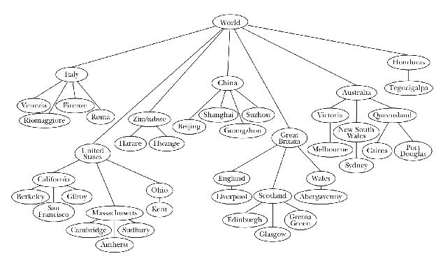

## Carvana Coding Challeng
This is my solution to the carvana coding challenge!

### Requirements
- `gcc` compiler
- If you want to test the naive solution, you need to have `jupyter` with `pandas` installed (`pip install jupyter pandas`)

### How to use
- Clone this repository
- Enter the 
- Compile the trie with `g++ trie.cpp -o trie`
- Run the trie with `./trie [filename(s) to process (separated by spaces)]`

*The repository contains data in `data/test_small.txt` and `data/test_tiny.txt`*

*Example command: `g++ trie.cpp -o trie; ./trie ../data/test_small.txt ../data/test_small.txt`*

### How it works
`naive.ipynb` contains python code on various naive solutions 
    *It clearly runs inefficiently. They both load the entire file into memory before processing it and create a large hashmap containing every pair of words, making the code both time and space inefficient*
`trie.cpp` contains C++ code which creates a [trie](https://arxiv.org/pdf/1806.09447.pdf) using the corpus
    *This tree contains words at each node, making the tree more space efficient. It also scans the corpus at each line only one line of the file has to be loaded into memory at a time.*

### What's next
I spent most of my time on efficiency, rather than meeting extra requirements. I would start by testing my code and building out the `trie.cpp` to have it support other applications than just counting pairs of words.

Some test cases I haven't considered:
- Non-unicode characters
- Handling line-endings and small pairs of words
- Handling words with a large number of characters
- Handling large files with entirely unique characters

Also, I started `trieletters.cpp` as a more efficient implementation of `trie.cpp` which uses individual letters as nodes in the tree rather than entire words. This uses more primitive datatypes and less expensive C objects and would run faster. I ran into road blocks with `segmentation fault` errors, which is why the file is half-way done.